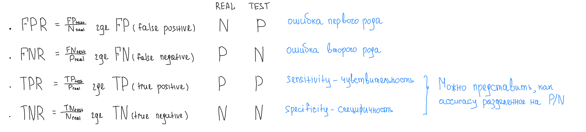
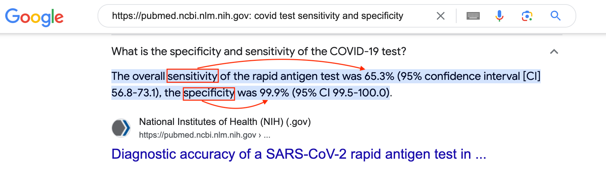
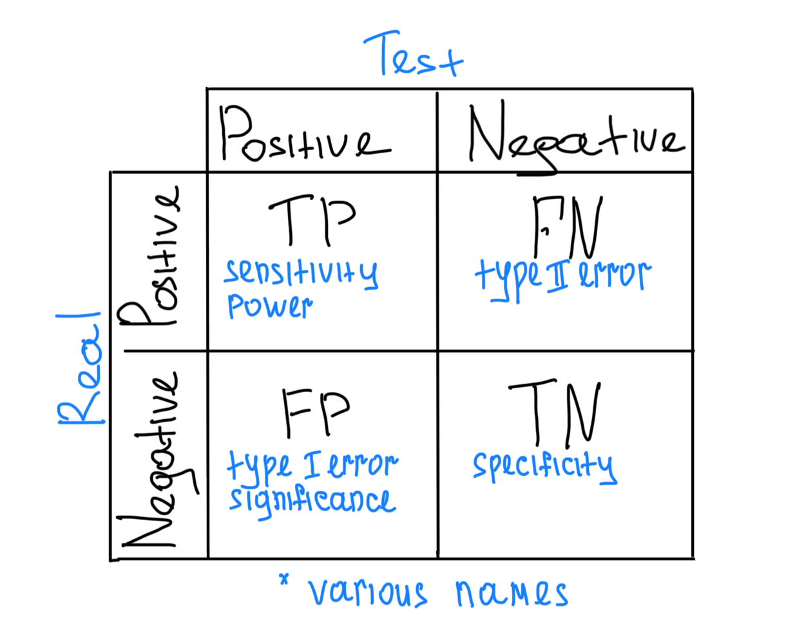
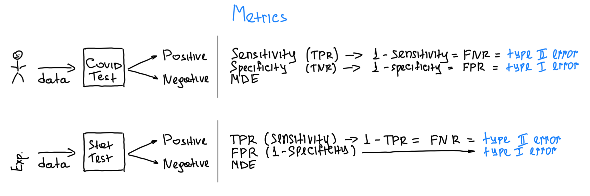
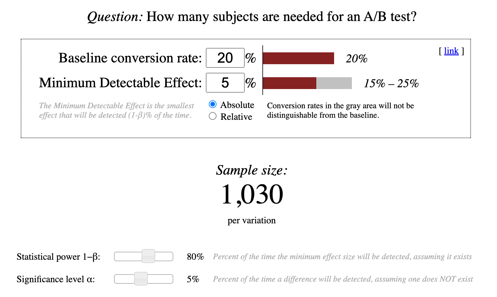

# AB Test

АБ тестирование - методология проверки гипотез состоящая из двух частей:

- Проведения эксперимента для сбора данных изолированных от влияния внешних факторов.
- Статистического анализа для решения проблемы "случайности".

Для интуитивного понимания данной методологии пойдем от простого к сложному.

## Метрики для тестов с бинарным ответом.

Предположим, что у нас есть четыре пациента и два разных теста для диагностирования Covid.
Наша задача - понять какой тест работает лучше.

  

Как сравнить результаты такого тестирования и понять, какой тест лучше/хуже? Так как мы знаем реальное положение
дел (`Real`), то самый простой способ - посчитать долю правильных ответов (`Accuracy`) каждого теста:

- `Test1` - 75% (3 из 4)
- `Test2` - 100% (4 из 4)

Отлично! У нас появился инструмент для сравнения бинарных тестов. Но, что если мы будем тестировать не четырех
пациентов, а сто? И пусть 99 будут здоровы, а один из них будет носителем редкой формы Covid. Тогда:

- В реальности: `Negative = 99` и `Positive = 1`
- В тесте: пропускаем редкую форму Covid и получаем `Negative = 100`
- Считаем `Accuracy` и получаем потрясающую точность в 99% (99/100), но такой тест __бесполезен__. Он вводит в
  заблуждение. Мы будем думать, что у нас высокая точность теста, а причина будет в
  редкости искомого `Positive`. Это происходит из-за того, что в таком подходе для `Accuracy` нет разницы в какую
  сторону ошибиться (называть больного здоровым или здорового больным).

Что же делать, что бы избежать такой ложной точности в оценки тестов? Считать точность теста отдельно для каждого типа
ответа `Positive` и `Negative`.

  

 

Рассмотрим на реальном примере, как следует интерпретировать `Sensitivity` и `Specificity`.

  

- `Sensitivity`(`TPR`) - допустим, что в реальности есть 100 `Positive` пациентов. В таком случае, наш тест определит
  __реальное наличие__ Covid только в 65% случаев (`True Positive`).
- `Specificity`(`TNR`) - допустим, что в реальности есть 100 `Negative` пациентов. В таком случае, наш тест определит
  __реальное отсутствие__ Covid в 99% случаев (`True Negative`). Иными словами, получаем
  очень редкое ложное срабатывание (`Falce Positive`).

## Confusion Matrix - мать всех метрик, или почти всех.

  

Про матрицу ошибок можно:

- Отличная статья на [wiki](https://en.wikipedia.org/wiki/Confusion_matrix) про саму матрицу.
- Метрики, которые можно рассчитать через матрицу
  ошибок [wiki](https://en.wikipedia.org/wiki/Template:Confusion_matrix_terms/sandbox).

## CovidTest vs StatTest

В статистическом тесте смотрят на те же метрики, что и в CovidTest, но оценивают не % правильных ответов,
а __% ошибок__.
Статистический анализ строится от анализа ошибок. Для наглядности сравним это все в одной картинке.

  

И трактовать метрики СтатТеста стоит следующим образом:

- `TruePositiveRate` (`TPR`) - % случаев, когда СтатТест показал наличие разницы и она действительно есть.
- `FalsePositiveRate` (`FPR`) - % случаев, когда СтатТест показал наличие разницы, но на самом деле ее не было.
- `MDE` - минимальная реальная разница, которую может обнаружить СтатТест.

## AB Test Calculator

Общая концепция проведения АБ тестов выглядит так:

- Формируем гипотезу.
- Формируем желаемые метрики предстоящего эксперимента: CR, TRP, FPR, MDE.
- Считаем необходимый размер выборки для проведения эксперимента. Для данного расчета используем математические методы (
  или специальные калькуляторы, например такой [evanmiller](https://www.evanmiller.org/ab-testing/)).
- Проводим симуляции с помощью метода Монтекарло, чтобы проверить, что предварительные расчеты сходятся.

На примере уже упоминавшегося [evanmiller](https://www.evanmiller.org/ab-testing/) рассмотрим как названия одних и тех
же сущностей опять изменились :)

  

Метрики в калькуляторе:

- `Baseline conversion rate` - текущая конверсия, до начала предстоящего эксперимента.
- `Minimum Detectable Effect` - желаемая минимальная разница, которую должен корректно детектировать СтатТест.
- `Statistical power 1−β` - желаемый __минимальный__ `TPR`. В скольки % случае СтатТест будет детектировать реально
  существующую разницу в выбранном `MDE`.
- `Significance level α` - желаемый __максимальный__ `FPR`. В скольки % случаем СтатТест будет допускать ошибку I-рода
(ложное срабатывание).  
