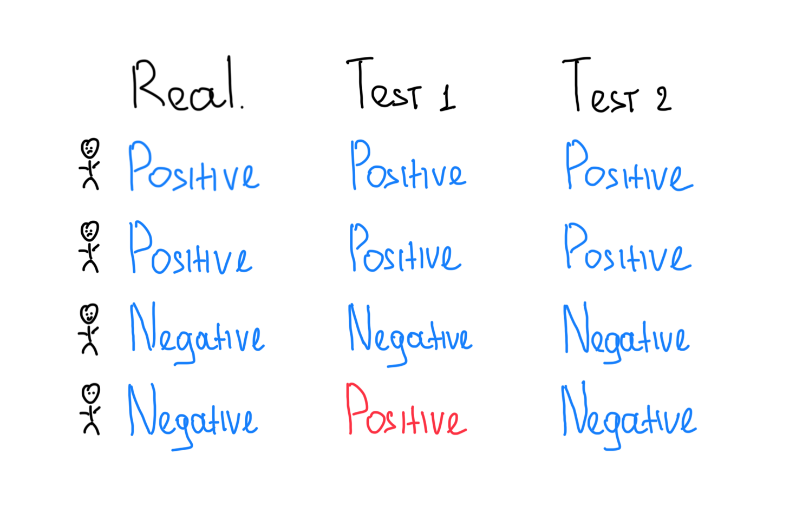
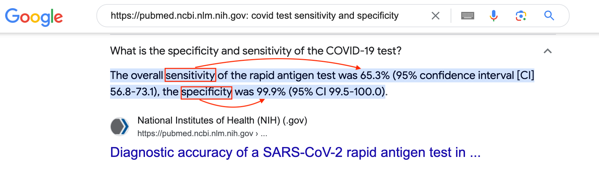

# AB Test

АБ тестирование - методология проверки гипотез состоящая из двух частей:

- Проведения эксперимента для сбора данных изолированных от влияния внешних факторов.
- Статистического анализа для решения проблемы "случайности".

Для интуитивного понимания данной методологии пойдем от простого к сложному.

## Метрики для тестов с бинарным ответом

Предположим, что у нас есть четыре пациента и два разных теста для диагностирования Covid.
Наша задача - понять какой тест работает лучше.

  

  

Как сравнить результаты такого тестирования и понять, какой тест лучше/хуже? Так как мы знаем реальное положение
дел (`Real`), то самый простой способ - посчитать долю правильных ответов (`Accuracy`) каждого теста:

- `Test1` - 75% (3 из 4)
- `Test2` - 100% (4 из 4)

Отлично! У нас появился инструмент для сравнения бинарных тестов. Но, что если мы будем тестировать не четырех
пациентов, а сто? И пусть 99 будут здоровы, а один из них будет носителем редкой формы Covid. Тогда:

- В реальности: `Negative = 99` и `Positive = 1`
- В тесте: пропускаем редкую форму Covid и получаем `Negative = 100`
- Считаем `Accuracy` и получаем потрясающую точность в 99% (99/100), но такой тест 
  бесполезен. Он вводит в заблуждение. Мы будем думать, что у нас высокая точность теста, а причина будет в
  редкости искомого `Positive`. Это происходит из-за того, что в таком подходе для `Accuracy` нет разницы в какую
  сторону ошибиться (называть больного здоровым или здорового больным).

Что же делать, что бы избежать такой ложной точности в оценки тестов? Считать точность теста отдельно для каждого типа
ответа `Positive` и `Negative`.

  

 

Рассмотрим на реальном примере, как следует интерпретировать `Sensitivity` и `Specificity`.

  

- `Sensitivity`(`TPR`) - допустим, что в реальности есть 100 `Positive` пациентов. В таком случае, наш тест определит
  __реальное наличие__ Covid только в 65% случаев (`True Positive`).
- `Specificity`(`TNR`) - допустим, что в реальности есть 100 `Negative` пациентов. В таком случае, наш тест определит 
  __реальное отсутствие__ Covid в 99% случаев (`True Negative`). Иными словами, получаем
  очень редкое ложное срабатывание (`Falce Positive`).
  

 

